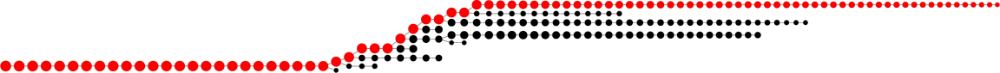
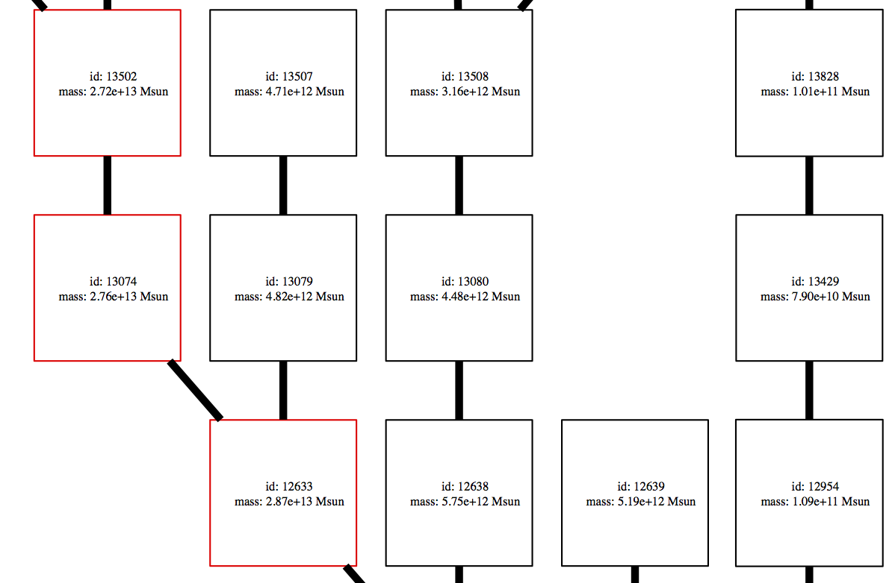
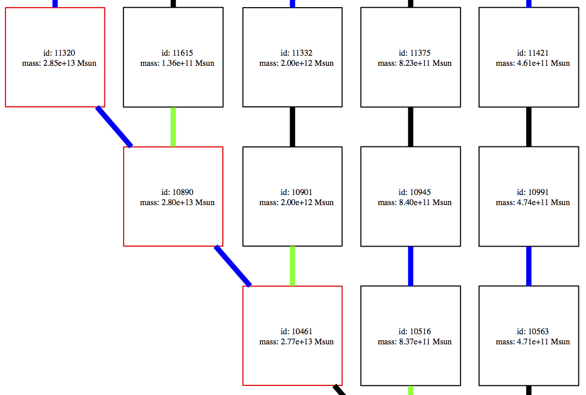

.. _plotting:

Plotting Merger Trees
=====================

Some relatively simple visualizations of merger trees can be made with
the :class:`~ytree.visualization.tree_plot.TreePlot` command.

Additional Dependencies
-----------------------

Making merger tree plots with ``ytree`` requires the
`pydot <https://pypi.org/project/pydot/>`__ and
`graphviz <https://www.graphviz.org/>`__ packages. ``pydot`` can be
installed with ``pip`` and the
`graphviz <https://www.graphviz.org/>`__ website provides a number
of installation options.

Making Tree Plots
-----------------

The :class:`~ytree.visualization.tree_plot.TreePlot` command can be
used to create a `digraph <https://en.wikipedia.org/wiki/Directed_graph>`__
depicting halos as filled circles with sizes proportional to their mass.
The main progenitor line will be colored red.

.. code-block:: python

    >>> import ytree
    >>> a = ytree.load("ahf_halos/snap_N64L16_000.parameter",
    ...                hubble_constant=0.7)
    >>> p = ytree.TreePlot(a[0], dot_kwargs={'rankdir': 'LR', 'size': '"12,4"'})
    >>> p.save('tree.png')

Plot Modifications
^^^^^^^^^^^^^^^^^^

Four :class:`~ytree.visualization.tree_plot.TreePlot` attributes can be set
to modify the default plotting behavior. These are:

- *size_field*: The field to determine the size of each circle. Default:
  'mass'.

- *size_log*: Whether to scale circle sizes based on log of size field.
  Default: True.

- *min_mass*: The minimum halo mass to be included in the plot. If given
  as a float, units are assumed to be Msun. Default: None.

- *min_mass_ratio*: The minimum ratio between a halo's mass and the mass
  of the main halo to be included in the plot. Default: None.

.. code-block:: python

   >>> import ytree
   >>> a = ytree.load("ahf_halos/snap_N64L16_000.parameter",
   ...                hubble_constant=0.7)
   >>> p = ytree.TreePlot(a[0], dot_kwargs={'rankdir': 'LR', 'size': '"12,4"'})
   >>> p.min_mass_ratio = 0.01
   >>> p.save('tree_small.png')

Customizing Node Appearance
^^^^^^^^^^^^^^^^^^^^^^^^^^^

The appearance of the nodes can be customized by providing a function that
returns a dictionary of keywords that will be used to create the ``pydot``
node. This should accept a single argument that is a
:class:`~ytree.data_structures.tree_node.TreeNode` object representing the
halo to be plotted. For example, the following function will add labels of
the halo id and mass and make the node shape square. It will also color
the most massive progenitor red.

.. code-block:: python

    def my_node(halo):
        prog = list(halo.find_root()['prog', 'uid'])
        if halo['uid'] in prog:
            color = 'red'
        else:
            color = 'black'

        label = \
        """
        id: %d
        mass: %.2e Msun
        """ % (halo['uid'], halo['mass'].to('Msun'))

        my_kwargs = {"label": label, "fontsize": 8,
                     "shape": "square", "color": color}
        return my_kwargs

This function is then provided with the *node_function* keyword.

.. code-block:: python

   >>> p = ytree.TreePlot(tree, dot_kwargs={'rankdir': "BT"},
   ...                    node_function=my_node)
   >>> p.save('tree_custom_node.png')

Customizing Edge Appearance
^^^^^^^^^^^^^^^^^^^^^^^^^^^

The edges of the plot are the lines connecting each of the nodes. Similar to
the nodes, their appearance can be customized by providing a function that
returns a dictionary of keywords that will be used to create the ``pydot``
edge. This should accept two
:class:`~ytree.data_structures.tree_node.TreeNode` arguments representing
the ancestor and descendent halos being connected by the edge. The example
below colors the edges blue when the descendent is less massive than its
ancestor and green when the descendent is more than 10 times more massive
than its ancestor.

.. code-block:: python

   def my_edge(ancestor, descendent):
       if descendent['mass'] < ancestor['mass']:
           color = 'blue'
       elif descendent['mass'] / ancestor['mass'] > 10:
           color = 'green'
       else:
           color = 'black'

       my_kwargs = {"color": color, "penwidth": 5}
       return my_kwargs

This function is then provided with the *edge_function* keyword.

.. code-block:: python

   >>> p = ytree.TreePlot(tree, dot_kwargs={'rankdir': "BT"},
   ...                    node_function=my_node,
   ...                    edge_function=my_edge)
   >>> p.save('tree_custom_edge.png')

Supported Output Formats
^^^^^^^^^^^^^^^^^^^^^^^^

Plots can be saved to any format supported by ``graphviz`` by giving a
filename with the appropriate extension. See
`here <https://www.graphviz.org/doc/info/output.html>`__ for a list of
currently supported formats.
